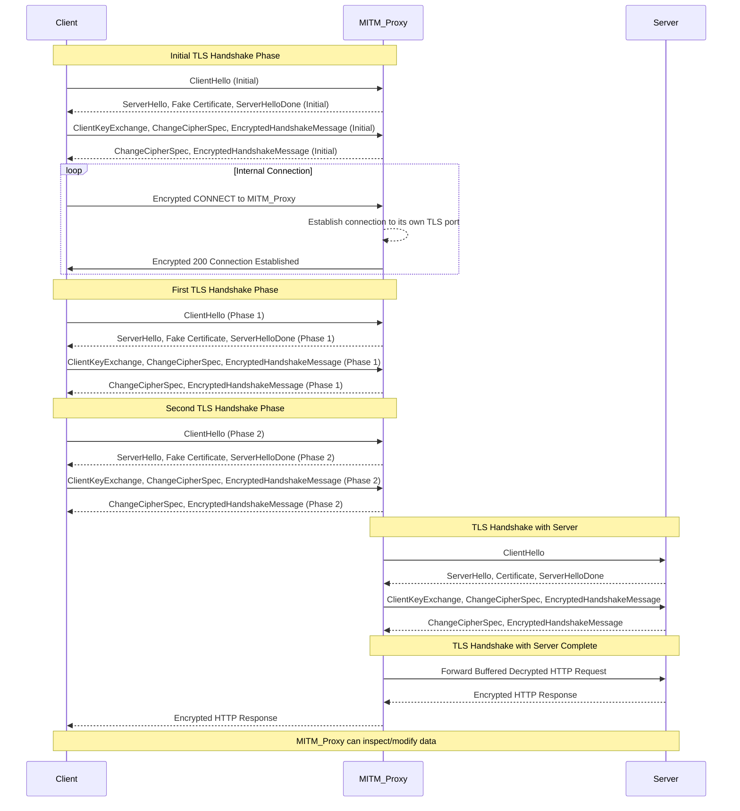

HTTP(S) Connect Tunneling
===

```mermaid
sequenceDiagram
    participant Client
    participant MITM_Proxy
    participant Server

    Note over Client,MITM_Proxy: Initial TLS Handshake Phase

    Client->>MITM_Proxy: ClientHello (Initial)
    MITM_Proxy-->>Client: ServerHello, Fake Certificate, ServerHelloDone (Initial)
    Client->>MITM_Proxy: ClientKeyExchange, ChangeCipherSpec, EncryptedHandshakeMessage (Initial)
    MITM_Proxy-->>Client: ChangeCipherSpec, EncryptedHandshakeMessage (Initial)

    loop Internal Connection
        Client->>MITM_Proxy: Encrypted CONNECT to MITM_Proxy
        MITM_Proxy-->>MITM_Proxy: Establish connection to its own TLS port
        MITM_Proxy->>Client: Encrypted 200 Connection Established
    end

    Note over Client,MITM_Proxy: First TLS Handshake Phase
    
    Client->>MITM_Proxy: ClientHello (Phase 1)
    MITM_Proxy-->>Client: ServerHello, Fake Certificate, ServerHelloDone (Phase 1)
    Client->>MITM_Proxy: ClientKeyExchange, ChangeCipherSpec, EncryptedHandshakeMessage (Phase 1)
    MITM_Proxy-->>Client: ChangeCipherSpec, EncryptedHandshakeMessage (Phase 1)

    Note over Client,MITM_Proxy: Second TLS Handshake Phase

    Client->>MITM_Proxy: ClientHello (Phase 2)
    MITM_Proxy-->>Client: ServerHello, Fake Certificate, ServerHelloDone (Phase 2)
    Client->>MITM_Proxy: ClientKeyExchange, ChangeCipherSpec, EncryptedHandshakeMessage (Phase 2)
    MITM_Proxy-->>Client: ChangeCipherSpec, EncryptedHandshakeMessage (Phase 2)

    Note over MITM_Proxy,Server: TLS Handshake with Server

    MITM_Proxy->>Server: ClientHello
    Server-->>MITM_Proxy: ServerHello, Certificate, ServerHelloDone
    MITM_Proxy->>Server: ClientKeyExchange, ChangeCipherSpec, EncryptedHandshakeMessage
    Server-->>MITM_Proxy: ChangeCipherSpec, EncryptedHandshakeMessage

    Note over MITM_Proxy,Server: TLS Handshake with Server Complete

    MITM_Proxy->>Server: Forward Buffered Decrypted HTTP Request
    Server-->>MITM_Proxy: Encrypted HTTP Response
    MITM_Proxy-->>Client: Encrypted HTTP Response

    Note over Client,Server: MITM_Proxy can inspect/modify data
```